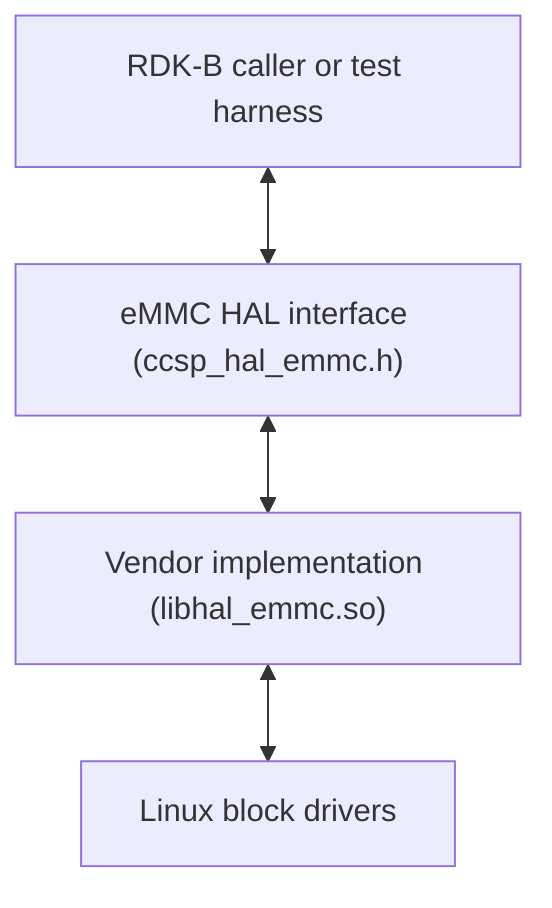
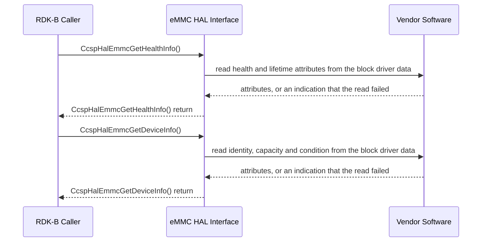

# eMMC HAL Documentation

## Version History

| Date | Comment | Version |
| --- | --- | --- |
| 03/12/24 | Initial specification, published with release `1.0.0`. The page declared no document revision of its own. | 1.0.0 |
| 08/24/26 | Restructured to the canonical HAL specification topic set. API surface, data types, status reporting and the absence of an asynchronous path documented against `include/ccsp_hal_emmc.h`. | 1.1.0 |

**Provenance of this page.** It was renamed from `docs/pages/eMMCHalSpec.md` to `docs/pages/halSpec.md` in the same change that rewrote it against the canonical topic set. Git records a rename only where the two versions still resemble each other, and a full rewrite does not, so `git log --follow -- docs/pages/halSpec.md` begins at that change: the revisions before it are reached with `git log -- docs/pages/eMMCHalSpec.md`.

The `Version` column above is the revision of **this document** and nothing else. Three further
version identities exist in this repository and none of them is the document revision, so they are
recorded here once, separately, to keep them apart:

- **Interface version** \- **not specified by this interface.** `include/ccsp_hal_emmc.h` declares no
  version macro, so a caller can neither test the interface version at compile time nor read it at
  runtime. See `Variability Management` for what follows from that.
- **Release tag** \- `1.0.0`, the only tag in this repository, dated 12 March 2024. It is written
  without a `v` prefix. This is the release the document describes.
- **Generated-site version string** \- `docs/generate_docs.sh` passes `PROJECT_VERSION` from
  `git describe --tags`, which takes the form `1.0.0-<n>-g<abbreviated-commit>` whenever the built
  revision is not the tagged one: `<n>` is the number of commits since tag `1.0.0` and the suffix is
  the abbreviated commit hash. That string identifies a build, **not** a version of the interface or
  of this document, and it changes with every commit.

*Sources: the repository-root `CHANGELOG.md`, symlinked into this directory as
`docs/pages/CHANGELOG.md`, and this repository's tag `1.0.0` for the release identity;
`include/ccsp_hal_emmc.h` for the absence of a version macro; `docs/generate_docs.sh` for
`PROJECT_VERSION`.*

## Acronyms

- `HAL` \- Hardware Abstraction Layer
- `RDK-B` \- Reference Design Kit for Broadband Devices
- `OEM` \- Original Equipment Manufacturer
- `eMMC` \- Embedded MultiMediaCard, the managed NAND flash device this interface reports on
- `SMART` \- Self-Monitoring, Analysis and Reporting Technology, the device self-diagnostics facility
- `SLA` \- Service Level Agreement

*Source: the terms this document itself uses. `HAL`, `RDK-B` and `OEM` are carried over from the
previous revision of this specification, which defined those three and no others. `eMMC` and `SMART`
expand terms `include/ccsp_hal_emmc.h` uses literally - the header's own `m_hasSMARTSupport` comment at
line 194 carries the same expansion of `SMART`, and line 70 describes the `SMART` attribute array this
document's `Data Structures and Defines` topic covers. `SLA` expands the Service Level Agreement term
the previous revision states and `Variability Management` below restates; it does not appear in the
header.*

## Description

The diagram below describes a high-level software architecture of the eMMC HAL module stack.

The eMMC HAL is an abstraction layer implemented to interact with the Linux device drivers of the
eMMC part, for the purpose of reading its health and device information. It is intended to be a
common HAL, usable by any CCSP component or process that needs those two records.

**No dedicated middleware service owns this interface.** That distinguishes it from most HALs in
RDK-B, where an owning service \- `CcspPandMSsp` for several of them \- drives the hardware, and a
caller must stop that service before exercising the HAL directly. There is no such service here, so
the chain above runs from the caller straight to the interface: an RDK-B component, or a test harness
standing in for one, calls the two functions itself.

The interface is deliberately small. It declares two functions, both read-only, both called on
demand rather than at boot, and it carries no session, no configuration and no notification path.
That makes it the smallest complete HAL contract in this workspace and a useful worked example when
establishing patterns that will later be applied to larger interfaces.

*Sources: `include/ccsp_hal_emmc.h` for the declared surface; the superproject `README.md` of the
RDK-B HAL workspace for the subject matter and for the absence of an owning service. That file lives
outside this repository, so it is cited by name rather than linked.*

## Optional Components

The interface itself is not optional: both declared functions are always present, and the header
carries no conditional compilation beyond its own include guard. What **is** optional is what a
vendor implementation reports through two of the fields it populates, and a caller that assumes
either one is present will misread the record.

- `m_hasSMARTSupport`, a field of `eSTMGRDeviceInfo`, states whether the device reports `SMART` data
  at all. When it is false, a caller must not expect the `SMART`-derived attributes of the health
  record to carry meaningful values. Support for `SMART` is therefore a property of the part and the
  implementation, not a guarantee of this interface.

- The diagnostics union in `eSTMGRHealthInfo` offers two mutually exclusive forms: `m_list`, a bounded
  set of structured name and value attribute pairs, or `m_blob`, an opaque buffer of up to 2048 bytes
  whose content and encoding are vendor-defined. A vendor populates one arm. **This interface
  declares no tag field or flag that selects between them**, so a caller cannot determine which arm
  is valid from the record alone and must not read either without a vendor agreement establishing
  which form the implementation populates. This is the one portability trap in an otherwise
  straightforward contract.

No other component, library or facility is declared optional by this interface.

*Source: `include/ccsp_hal_emmc.h` \- `eSTMGRDeviceInfo` and `eSTMGRHealthInfo`, including the
diagnostics union and its documented absence of a discriminator.*

## Component Runtime Execution Requirements

### Initialization and Startup

**There is no initialization, open or teardown call in this interface.** A caller does not open a
session, does not register anything and has nothing to release. The RDK eMMC HAL client module is
expected to call the corresponding function at runtime whenever health or device information is
needed, and the following functions are guaranteed not to be called during system bootup:

- `CcspHalEmmcGetHealthInfo`
- `CcspHalEmmcGetDeviceInfo`

Either function is expected to block if the hardware is not ready. This is a property of the
interface definition rather than an observed measurement: see `Quality Control` for why no timing
claim in this document is presented as measured behaviour.

*Sources: `include/ccsp_hal_emmc.h` \- the two declarations and their `@pre` blocks, which state
that the interface imposes no call ordering; the previous revision of this specification for the
not-at-boot guarantee.*

### Threading Model

**The interface is not required to be thread-safe.**

Any module which is invoking an eMMC HAL function is responsible for ensuring that its calls are
made in a thread safe manner, which in practice means serialising them.

Vendors may create internal threads and event mechanisms to meet their operational requirements.
Those mechanisms must synchronise access between the calls and events they serve, and must be
cleaned up when the vendor software terminates or closes its connection to the HAL.

*Sources: the previous revision of this specification; `include/ccsp_hal_emmc.h` \- the `@warning`
block on each declaration, which places the serialisation obligation on the calling module.*

### Process Model

Both functions are expected to be callable from multiple processes. Because this interface places
the synchronisation obligation on the caller rather than on the implementation, concurrent use from
more than one process is the caller's to coordinate; a vendor implementation may use internal
threads or events to serve those callers provided it synchronises them and cleans them up on
closure.

*Sources: the previous revision of this specification; `include/ccsp_hal_emmc.h` \- the `@warning`
block on each declaration.*

### Memory Model

Both functions take a pointer to a record the caller supplies, and the caller supplies it because
this interface declares no allocator: there is no call here that returns storage, and none that
releases it. **Ownership therefore does not transfer** - there is no release call an implementation
could use, so the caller remains responsible for freeing the record - but **what happens to the
pointer after the call is not stated.** This interface says nothing about whether an implementation
retains it, and that silence is not permission: it must not be read as a guarantee that reusing or
releasing the storage the moment the function returns is safe. The conservative course is storage
that outlives the caller's use of this interface; a caller that releases the record immediately is
relying on behaviour this interface has not stated, and should establish it with the vendor rather
than infer it from this specification.

#### Caller Responsibilities

- Allocate and deallocate the memory for parameters passed to the functions, as outlined in the API
  documentation, to prevent memory leaks. For both declared functions this is a single record of the
  declared type, `eSTMGRHealthInfo` or `eSTMGRDeviceInfo`.
- Pass a non-`NULL` pointer that addresses storage of the declared type. A pointer that does not is
  reported as `RDK_STMGR_RETURN_INVALID_INPUT` and nothing is written.
- Bound every read of a populated record by the fixed array sizes and the accompanying element
  counts the interface declares, which `Data Structures and Defines` sets out per type.

#### Module Responsibilities

- Manage and deallocate the memory used for its internal operations.
- Release all internally allocated memory upon closure, to prevent memory leaks.
- Populate the caller's record in place. The implementation allocates nothing on the caller's behalf
  and hands back no buffer for the caller to free.

*Sources: the previous revision of this specification for the responsibility split;
`include/ccsp_hal_emmc.h` \- the `@param[out]` block on each declaration for ownership and bounds.*

### Power Management Requirements

The eMMC HAL is not involved in any power management operation. It declares no power state, no
transition and no notification of one, and neither function takes or returns a power-related value.

*Sources: the previous revision of this specification; `include/ccsp_hal_emmc.h` \- the declared
surface, which carries no power-related type or argument.*

### Asynchronous Notification Model

**There are no asynchronous notifications.** A caller cannot subscribe to a storage event through
this interface, and the evidence is in the header rather than in this statement alone:

- The callback type that would carry an event is present only as a commented-out declaration
  ([`include/ccsp_hal_emmc.h:315`](../../include/ccsp_hal_emmc.h)), so it is not declared at all.
- No registration, subscription or unsubscription function is declared anywhere in the header.
- Consequently `eSTMGREvents`, `eSTMGREventMessage` and `eSTMGRCallBackData` are **unreachable
  through the declared API surface**, even though the documentation generator extracts them and a
  reader of the generated site therefore sees them.

A caller that needs to observe a change re-reads the record by calling the corresponding function
again. The interface offers no mechanism by which it would be told.

*Source: `include/ccsp_hal_emmc.h` \- the commented-out callback declaration, the absence of any
registration function, and the `@warning` blocks on `eSTMGREvents` and `eSTMGREventMessage` that
state the same conclusion.*

### Blocking calls

Both functions are expected to work synchronously and to complete within a time period commensurate
with the complexity of the operation and in accordance with any relevant specification.

Any call that can fail due to the lack of a response should apply a timeout period in accordance
with the API documentation. **This interface states no numeric timeout**, so a caller that cannot
tolerate an unbounded wait imposes its own bound rather than relying on one here. Note that the call
may block until the eMMC hardware is ready, which is stated under `Initialization and Startup`.

*Sources: the previous revision of this specification; `include/ccsp_hal_emmc.h` \- the blocking
`@note` on each declaration.*

### Internal Error Handling

All functions are designed to return errors synchronously, as the function's return value. There is
no error callback, no error queue and no out-of-band error channel. The responsibility to manage
system errors, such as memory shortages, lies with the caller.

The return value is an `eSTMGRReturns` code, and the same five codes apply to both functions:
`RDK_STMGR_RETURN_SUCCESS`, `RDK_STMGR_RETURN_GENERIC_FAILURE`, `RDK_STMGR_RETURN_INIT_FAILURE`,
`RDK_STMGR_RETURN_INVALID_INPUT` and `RDK_STMGR_RETURN_UNKNOWN_FAILURE`. What a client should do for
each is documented per function in the header, and `Data Structures and Defines` records the values.

One consequence is worth stating explicitly, because the code name suggests otherwise:
`RDK_STMGR_RETURN_INIT_FAILURE` reports that the implementation could not bring up the resources it
needs to reach the device. Since this interface declares no initialization call, there is no
caller-side initialization step to repeat in response to it.

*Sources: the previous revision of this specification; `include/ccsp_hal_emmc.h` \- `eSTMGRReturns`
and the `@retval` blocks on both declarations.*

### Persistence Model

There is no requirement for the HAL to persist any setting information. Both functions are read-only
and neither accepts a value to store. A caller is responsible for persisting any settings related to
its own implementation.

*Sources: the previous revision of this specification; `include/ccsp_hal_emmc.h` \- the declared
surface, which contains no setter.*

## Non functional requirements

The following non functional requirements should be supported by the eMMC HAL component.

*Source: the previous revision of this specification. Each topic below names its own source.*

### Logging and debugging requirements

The component is required to record all errors and critical informative messages, so that issues can
be identified and triaged and the functional flow of the system can be understood. Logging should be
implemented using the syslog method, which provides logging capabilities suited to system-level
software; the use of `printf` is discouraged unless `syslog` is not available.

All HAL components must adhere to a consistent logging process. Where a vendor implementation logs,
it must log to a file named `emmc_vendor_hal.log`. **This interface does not specify the directory
that file is written to**, so a vendor's deployment determines it; a caller should not assume a
location.

Logs must be categorised according to the following log levels, as defined by the Linux standard
logging system, listed here in descending order of severity:

- **FATAL:** Critical conditions, typically indicating system crashes or severe failures that require
  immediate attention.
- **ERROR:** Non-fatal error conditions that nonetheless significantly impede normal operation.
- **WARNING:** Potentially harmful situations that do not yet represent errors.
- **NOTICE:** Important but not error-level events.
- **INFO:** General informational messages that highlight system operations.
- **DEBUG:** Detailed information typically useful only when diagnosing problems.
- **TRACE:** Very fine-grained logging to trace the internal flow of the system.

Each log entry should include a timestamp, the log level and a message describing the event or
condition. This standard format makes log files easier to parse and compare across vendors and
components.

**Handling of device identity in log and debug output.** This interface carries no password, key,
token or other credential \- there is no such field in either record it populates, and no argument
of either declaration accepts one \- so nothing here needs the secret-handling rules a
credential-bearing HAL requires. It does carry device identity, and that is excluded from the log
described above on the same terms:

- `eSTMGRDeviceInfo.m_deviceID` and `eSTMGRDeviceInfo.m_serialNumber` each identify one specific
  part in one specific unit, and the header states that the two are not required to carry the same
  value, so both are identifiers in their own right.
- `eSTMGRDeviceInfo.m_manufacturer`, `m_model`, `m_firmwareVersion` and `m_hwVersion` identify the
  part rather than the unit. On their own they are not personal data; together with a device
  identifier, or with a subscriber record, they narrow a unit to a small population.
- `eSTMGRHealthInfo.m_deviceID` repeats the identifier in the health record, so a health or
  diagnostic path discloses it as readily as an inventory path.

The following requirements bind the vendor implementation and the `RDK-B` caller equally.

- **No identifier is written to log output at any severity.** Not at **FATAL**, and not at **DEBUG**
  or **TRACE** either: a value too sensitive for **INFO** does not become acceptable lower down the
  ladder, and a build that enables fine-grained tracing must not become a build that publishes the
  serial number of every unit in a fleet.
- **Redact with one fixed marker, and never emit a fragment.** A prefix, a suffix, a length or a
  hash is not a redaction: an identifier prefix generally names a manufacturer and a production
  batch, which is most of what an identifier discloses. Where a record must say what it acted on, it
  names the operation, the outcome and a non-identifying discriminator \- the device type from
  `eSTMGRDeviceType`, or the index within the call \- and substitutes the same fixed marker for the
  identifier itself.
- **Crash artefacts and telemetry are in scope.** A core file, a crash report, a diagnostic bundle
  collected off the device and any telemetry or metrics record are log output for the purpose of
  these rules. An identifier kept out of `emmc_vendor_hal.log` and then carried off the device in a
  crash artefact has not been protected. This matters more here than in most HALs, because the whole
  purpose of `CcspHalEmmcGetHealthInfo` is to feed health reporting, and a health record that is
  forwarded with its `m_deviceID` intact turns a diagnostic pipeline into an identifier feed.
- **Clear after use.** Both records are caller-allocated, so clearing is the caller's to do:
  overwrite the record once it has been read rather than leaving identity in storage that will be
  reused, and do the same before releasing a heap-allocated record. An implementation clears its own
  working copies on the same terms.
- **A failure status does not license logging the input.** `RDK_STMGR_RETURN_INIT_FAILURE` and
  `RDK_STMGR_RETURN_GENERIC_FAILURE` convey no detail, which is exactly the situation in which an
  implementation is tempted to log what it read. It records the operation and the status instead. On
  failure the record's content is undefined in any case, so there is nothing in it worth logging.
- **The interface enforces none of this.** `include/ccsp_hal_emmc.h` declares no redaction helper, no
  opaque identity type and no flag by which a caller could ask an implementation to suppress these
  values; every identity field is a plain `char` array that any format string will print. An
  integrator establishes that a vendor implementation observes these rules by inspection or by
  contract, and treats their absence from a vendor log as unverified until it has done so.

*Sources: the previous revision of this specification for the log file name and for the requirement
that levels follow Linux standard logging; the severity ladder and entry format are the corpus-wide
convention this repository's requirement invokes; `include/ccsp_hal_emmc.h` \- the identity fields of
`eSTMGRDeviceInfo` and `eSTMGRHealthInfo`, the absence of any credential field in either record, and
the `eSTMGRReturns` values, for the identity-handling requirements.*

### Memory and performance requirements

The eMMC HAL should not contribute disproportionately to memory or CPU utilisation while performing
normal operations, and its resource use should be commensurate with the operation required. Both
declared functions populate a record of fixed size, so neither has an input-dependent cost and
neither allocates on the caller's behalf; the size of each record follows entirely from the declared
array bounds and element counts listed under `Data Structures and Defines`. `eSTMGRHealthInfo` is the
larger of the two, carrying five bounded attribute lists in addition to the identity and flag fields.

**No memory footprint limit is specified for this interface.** No figure is stated here, because
none is stated by the interface and a figure a specification invents is worse than none: a caller
would size against it and a vendor would be held to it. A deployment that needs a bound measures the
vendor implementation on its own hardware and imposes the bound itself. The memory ownership rules
that *are* specified are in `Memory Model`.

*Sources: the previous revision of this specification; `include/ccsp_hal_emmc.h` \-
`RDK_STMGR_DIAGNOSTICS_BLOB_LENGTH` and the fixed-size record definitions.*

### Quality Control

To maintain software quality, it is recommended that the eMMC HAL implementation is verified without
errors using third-party tools such as `Coverity`, `Black Duck` and `Valgrind`. The goal is to detect
and resolve memory leaks, memory corruption and similar defects before deployment.

Two limits on what may be verified from this repository, and one obligation on keeping this document
true, belong here rather than being left implicit:

**Verification limit.** eMMC is not available on the HUB6 or XER10 reference platforms, so its
documented runtime behaviour can be verified against the interface definition but cannot be exercised
on either reference platform. Every statement in this document about blocking, timing or resource use
is therefore **derived from the interface definition and is not presented as observed behaviour**.
Confirming any of them requires hardware carrying an eMMC part and a vendor implementation.

**Unspecified behaviour.** Where this interface establishes nothing, this document says so rather
than filling the gap: the interface version, the transition set behind the status values, the
timeout, the memory footprint, the log directory, the unit of `m_capacity`, and which arm of the
diagnostics union is valid are each recorded as unspecified in the topic that covers them. A test
author should treat those as open questions for the interface owner, not as behaviour to assert.

**Freshness trigger.** Any change to a file this document cites as a source obliges a review of the
topics that cite it \- above all `include/ccsp_hal_emmc.h`, on which `Data Structures and Defines`,
`API Surface`, `State Diagram` and every per-function statement depend. This repository declares no
`CODEOWNERS`, so the addressee for that review is the maintainer group that the repository-root
`CONTRIBUTING.md`, symlinked into this directory as `docs/pages/CONTRIBUTING.md`, directs
contributions to: raise an issue in the repository's issue tracker, open a pull request, and the team
reviews it before it is merged to mainline.

*Sources: the previous revision of this specification for the tool list; the repository-root
`CONTRIBUTING.md` for the review addressee; the superproject `README.md` of the RDK-B HAL workspace
for reference-platform availability.*

### Licensing

The eMMC HAL implementation is expected to be released under the Apache License 2.0. The licence
text, the copyright notice and the attribution notice accompanying this interface are in
[`LICENSE.md`](LICENSE.md), [`COPYING.md`](COPYING.md) and [`NOTICE.md`](NOTICE.md).

*Sources: the previous revision of this specification; the repository's own `LICENSE`, `COPYING` and
`NOTICE` files, and the Apache-2.0 header carried by `include/ccsp_hal_emmc.h`.*

### Build Requirements

The eMMC HAL source code should be capable of being built under the Linux Yocto environment, and the
recipe should deliver a **shared library** named `libhal_emmc.so`.

This repository ships the interface header and no implementation, so it declares no build manifest,
no recipe and no toolchain beyond the distribution environment named above; nothing further is
specified here because nothing further is specified by the repository. The header's only external
dependency is the C standard header `<stdbool.h>`, which it includes for the `bool` fields of
`eSTMGRDeviceInfo`, `eSTMGRHealthInfo` and `eSTMGRPartitionInfo`.

*Sources: the previous revision of this specification for the Yocto environment and the library name;
`include/ccsp_hal_emmc.h` for the single include. The library name is retained as declared and its
kind corrected: a `.so` is a shared object, and `Interface API Documentation` directs callers to add
a linker dependency on it.*

### Variability Management

The role of adjusting the interface, guided by versioning, rests solely within architecture
requirements. Thereafter, vendors are obliged to align their implementation with a designated version
of the interface. As per `SLA` terms, they may transition to newer versions based on demand needs.

Each API interface will be versioned using [Semantic Versioning 2.0.0](https://semver.org/spec/v2.0.0.html), and the
vendor code will comply with a specific version of the interface.

Two facts about *this* interface qualify that policy, and a caller needs both:

- **The interface declares no version macro.** There is no `_MAJOR_VERSION`, `_MINOR_VERSION` or
  equivalent define in `include/ccsp_hal_emmc.h`, so the interface version **is not specified by this
  interface** and a caller can neither test it at compile time nor read it at runtime. The release
  tag `1.0.0` identifies the repository release, not the interface; see `Version History` for the
  distinction between the two.
- **The interface declares no build-variability flag.** The only preprocessor conditional in the
  header is its own include guard, so no declaration, type or macro is excluded by any build
  configuration, and the surface a caller compiles against is the same on every platform.

*Source: `include/ccsp_hal_emmc.h` \- the full preprocessor and macro content of the header.*

### Platform or Product Customization

**No platform or product customization is specified for this interface.** It exposes no
customization point: there is no conditional compilation, no configuration file, no tunable macro
and no platform-selected variant of any declaration. A product integrating this HAL varies only in
the vendor implementation behind it, and the values that implementation reports \- device identity,
capacity, condition flags and the diagnostics form \- are the whole of the observable variation.

*Source: `include/ccsp_hal_emmc.h`; the previous revision of this specification recorded the same
answer for this topic as "None".*

## Interface API Documentation

All HAL function prototypes and datatype definitions are available in the
[`ccsp_hal_emmc.h`](../../include/ccsp_hal_emmc.h) header file, where each declaration carries the
per-function detail \- argument bounds, pre-conditions, post-conditions, every return value and its
consequence, blocking behaviour and thread safety \- that this document indexes rather than repeats.

To use the eMMC HAL from a component or process:

1. **Inclusion:** include `ccsp_hal_emmc.h` in the source that calls the interface.
2. **Linking:** add a linker dependency on `libhal_emmc`.

*Source: the previous revision of this specification; `include/ccsp_hal_emmc.h`.*

### Theory of operation and key concepts

eMMC health and device information is populated on the device globally. This interface fetches that
health and device information from the data the block drivers have already populated: it is a reader
over existing kernel-side data rather than a driver in its own right, which is why it needs no
session, no configuration and no notification path.

Two records express the whole contract. `eSTMGRHealthInfo` answers "is this part working and how much
life is left in it", carrying the operational and health flags and up to five sets of diagnostic
attributes. `eSTMGRDeviceInfo` answers "what part is this and what condition is it in", carrying
identity, capacity and the condition flags. Each has one function that populates it.

*Sources: the previous revision of this specification for the block-driver derivation;
`include/ccsp_hal_emmc.h` for the two records and their functions.*

#### Object Lifecycles

**The HAL creates no objects.** There is no handle, no identifier, no descriptor and no open/close
pairing anywhere in this interface, so there is no object whose lifecycle a caller manages on the
HAL's behalf.

The only lifecycle is that of the caller's own record. A caller allocates an `eSTMGRHealthInfo` or an
`eSTMGRDeviceInfo`, passes its address, reads the populated fields, and deallocates it when it is no
longer needed. The implementation populates the record in place. **Whether it also keeps the
pointer is not stated by this interface**, so - as `Memory Model` above sets out - a caller must not
take that silence as permission to reuse or release the storage the moment the function returns; the
conservative course is a record that outlives the caller's use of the interface.

*Source: `include/ccsp_hal_emmc.h` \- both declarations and their `@param[out]` blocks.*

#### Method Sequencing

**No call ordering is imposed.** There is no initialization call to precede the first read and no
teardown call to follow the last, so the two functions may be called in any order, independently, as
often as needed and on demand. Neither depends on the other having been called, and neither leaves
state behind that the other observes.

Two constraints do apply, and both come from elsewhere in this document rather than from an ordering
rule: a call may block until the hardware is ready, and calls must be serialised by the caller
because the interface is not required to be thread-safe.

*Source: `include/ccsp_hal_emmc.h` \- the `@pre` block on both declarations, which states that the
interface declares no initialization, open or teardown call and imposes no call ordering.*

#### State-Dependent Behavior

What a call returns varies with the condition of the device. The condition flags in
`eSTMGRDeviceInfo.m_status`, and the `m_isOperational` and `m_isHealthy` flags in `eSTMGRHealthInfo`,
are the fields through which that variation is reported, and three consequences follow for a caller:

- When `RDK_STMGR_DEVICE_STATUS_NOT_PRESENT` is set, the identity, capacity and free-space fields of
  the record carry no meaningful value.
- `m_isOperational` and `m_isHealthy` are declared separately and this interface states no
  relationship between them, so a caller reads both rather than inferring one from the other.
- On any failure code no field of the record may be relied on, and on success this interface does not
  state that fields the implementation could not read are zeroed, so an unset field is not
  meaningful either.

**This interface specifies no transition set.** It exposes condition values, not a state machine, and
it does not establish which transitions between them are legal or in what order they occur. See
`State Diagram`, where that finding is recorded in full.

*Source: `include/ccsp_hal_emmc.h` \- `eSTMGRDeviceStatus` and its `@note` that a caller must not
infer a state machine from its members, the `m_isOperational` and `m_isHealthy` field comments, and
the `@post` block on both declarations.*

### Data Structures and Defines

Every type below is declared in [`ccsp_hal_emmc.h`](../../include/ccsp_hal_emmc.h) under the
`EMMC_HAL_TYPES` documentation group. Line references are to that file at the revision this document
describes.

**Only two of the structures appear in a signature**, and they are the only two a caller ever
constructs: `eSTMGRHealthInfo` and `eSTMGRDeviceInfo`. Every other type either appears *inside* one
of those two, or exists in the header without being reachable through the declared API surface; both
cases are marked in the tables.

**Valued macros.** The macros are array sizes and element counts. Where a count accompanies an array,
the count bounds what a caller may read, not the macro.

| Define | Value | What it bounds |
| --- | --- | --- |
| `RDK_STMGR_MAX_DEVICES` | 10 | Element count of the per-device arrays in `eSTMGRDeviceIDs` and `eSTMGRDeviceInfoList` |
| `RDK_STMGR_MAX_STRING_LENGTH` | 128 | Size in bytes of every fixed identity and text array in the interface |
| `RDK_STMGR_PARTITION_LENGTH` | 256 | Size in bytes of `eSTMGRDeviceInfo.m_partitions`, whose layout is vendor-specific |
| `RDK_STMGR_DIAGNOSTICS_LENGTH` | 256 | Size in bytes of `eSTMGREventMessage.m_diagnostics` |
| `RDK_STMGR_DIAGNOSTICS_BLOB_LENGTH` | 2048 | Size in bytes of the opaque diagnostics buffer `eSTMGRHealthInfo.m_diagnostics.m_blob` |
| `RDK_STMGR_MAX_DIAGNOSTIC_ATTRIBUTES` | 20 | Element count of the `SMART` attribute array in `eSTMGRDiagAttributesList` |

`RDK_STMGR_MAX_STRING_LENGTH` is an **array size**, so a caller bounds its reads by it: this interface
does not state whether an implementation terminates a value that fills the array.

**The status code both functions return, `eSTMGRReturns`.**

| Code | Value | Meaning |
| --- | --- | --- |
| `RDK_STMGR_RETURN_SUCCESS` | 0 | The read succeeded and the record may be read |
| `RDK_STMGR_RETURN_GENERIC_FAILURE` | -1 | The read failed for a reason the implementation attributes to itself or the storage subsystem |
| `RDK_STMGR_RETURN_INIT_FAILURE` | -2 | The implementation could not bring up the resources it needs to reach the device |
| `RDK_STMGR_RETURN_INVALID_INPUT` | -3 | The supplied pointer is `NULL` or does not address storage of the declared type |
| `RDK_STMGR_RETURN_UNKNOWN_FAILURE` | -4 | The read failed for a reason the implementation cannot attribute |

The codes are negative, so a caller tests against `RDK_STMGR_RETURN_SUCCESS` rather than testing for
a non-zero value in the expectation that it means success.

**The class of medium a record describes, `eSTMGRDeviceType`.**

| Member | Value |
| --- | --- |
| `RDK_STMGR_DEVICE_TYPE_HDD` | 0 |
| `RDK_STMGR_DEVICE_TYPE_SDCARD` | 1 |
| `RDK_STMGR_DEVICE_TYPE_USB` | 2 |
| `RDK_STMGR_DEVICE_TYPE_FLASH` | 3 |
| `RDK_STMGR_DEVICE_TYPE_NVRAM` | 4 |
| `RDK_STMGR_DEVICE_TYPE_EMMCCARD` | 5 |
| `RDK_STMGR_DEVICE_TYPE_MAX` | 6 |

The enumeration is shared with the wider RDK storage data model, which is why it names media this
HAL does not report on. An eMMC implementation reports `RDK_STMGR_DEVICE_TYPE_EMMCCARD`.
`RDK_STMGR_DEVICE_TYPE_MAX` is a bound, not a device class.

**Condition flags, `eSTMGRDeviceStatus` \- the type most easily mis-used.**

**The non-zero members are bit flags, so a caller must test a status field with a bitwise AND and
must not compare it for equality against a single member.** An implementation may report several
conditions at once by combining them with a bitwise OR, so a field carrying both
`RDK_STMGR_DEVICE_STATUS_READ_ONLY` and `RDK_STMGR_DEVICE_STATUS_DISK_FULL` equals neither of them.

| Flag | Bit value | Meaning |
| --- | --- | --- |
| `RDK_STMGR_DEVICE_STATUS_OK` | 0 | No condition flag is set: no fault is reported |
| `RDK_STMGR_DEVICE_STATUS_READ_ONLY` | `1 << 0` | Reads are accepted but writes are not |
| `RDK_STMGR_DEVICE_STATUS_NOT_PRESENT` | `1 << 1` | No medium is present, so identity and capacity fields are not meaningful |
| `RDK_STMGR_DEVICE_STATUS_NOT_QUALIFIED` | `1 << 2` | A medium is present but is not a part the platform qualifies |
| `RDK_STMGR_DEVICE_STATUS_DISK_FULL` | `1 << 3` | No free space remains |
| `RDK_STMGR_DEVICE_STATUS_READ_FAILURE` | `1 << 4` | A read against the medium failed |
| `RDK_STMGR_DEVICE_STATUS_WRITE_FAILURE` | `1 << 5` | A write against the medium failed |
| `RDK_STMGR_DEVICE_STATUS_UNKNOWN` | `1 << 6` | The implementation could not determine the condition |

`RDK_STMGR_DEVICE_STATUS_OK` is the zero value and is the one member that cannot be tested with a
mask: it is recognised by comparing the whole field against zero.

**Event identifiers with no delivery path, `eSTMGREvents`.**

| Member | Value | Meaning |
| --- | --- | --- |
| `RDK_STMGR_EVENT_STATUS_CHANGED` | 100 | The condition flags reported for a device changed |
| `RDK_STMGR_EVENT_HEALTH_WARNING` | 101 | A health indicator crossed a threshold |
| `RDK_STMGR_EVENT_DEVICE_FAILURE` | 102 | The device failed and can no longer be relied on |

**No function declared in this header delivers these events**, for the reasons given under
`Asynchronous Notification Model`. They are declared because the message type that carries them is
part of the shared storage data model.

**Structures.**

| Structure | Declared at | What it represents and whether a caller uses it |
| --- | --- | --- |
| `eSTMGRDeviceIDs` | `ccsp_hal_emmc.h:169` | A bounded list of device identifiers. **Not populated by any declared function** |
| `eSTMGRDeviceInfo` | `ccsp_hal_emmc.h:195` | Identity, capacity and condition of one device. **Caller-constructed**, populated by `CcspHalEmmcGetDeviceInfo` |
| `eSTMGRDeviceInfoList` | `ccsp_hal_emmc.h:208` | A bounded list of `eSTMGRDeviceInfo` records. **Not populated by any declared function** |
| `eSTMGRPartitionInfo` | `ccsp_hal_emmc.h:226` | Identity, mount path, format, condition and capacity of one partition. **Not populated by any declared function** |
| `eSTMGRDiagAttributes` | `ccsp_hal_emmc.h:234` | One `SMART` diagnostic attribute as a name and a value. Read inside a health record |
| `eSTMGRDiagAttributesList` | `ccsp_hal_emmc.h:242` | Up to 20 `eSTMGRDiagAttributes` with the count that are valid. Read inside a health record |
| `eSTMGRHealthInfo` | `ccsp_hal_emmc.h:270` | Operational and health state with the diagnostics union and four attribute lists. **Caller-constructed**, populated by `CcspHalEmmcGetHealthInfo` |
| `eSTMGREventMessage` | `ccsp_hal_emmc.h:290` | An event, the device it concerns and its diagnostic context. **Not delivered by any declared function** |
| `eSTMGRCallBackData` | `ccsp_hal_emmc.h:304` | Callback context: an SD-card flag and a mount path. **Not passed by any declared function** |

Three points a caller needs from the two records it does construct:

- **The diagnostics union in `eSTMGRHealthInfo` has no discriminator.** `m_list` and `m_blob` are
  mutually exclusive and no tag field selects between them, so neither may be read without a vendor
  agreement establishing which form the implementation populates. `m_hasSMARTSupport` is **not** that
  discriminator: it is a field of the *other* record and tells a caller only whether the device
  reports `SMART` data at all.
- **The `eSTMGRDeviceInfo.m_capacity` field carries no stated unit,** so a caller must not assume bytes; the
  capacity and free-space fields of `eSTMGRPartitionInfo` *are* stated in bytes, which makes the
  asymmetry easy to miss.
- Every text field is a fixed-size array whose content is vendor-supplied. Identity, model, firmware
  and hardware version and the partition description are read as opaque vendor text, not parsed
  against a format this interface defines.

**Unreachable types.** `eSTMGREvents`, `eSTMGREventMessage`, `eSTMGRCallBackData`, `eSTMGRDeviceIDs`,
`eSTMGRDeviceInfoList` and `eSTMGRPartitionInfo` are declared but are not reachable through the
declared API surface: no declared function populates, delivers or accepts any of them. They belong to
the shared RDK storage data model from which this header derives. They are listed here because the
documentation generator extracts every type in the header, so a reader of the generated site sees
them and would otherwise have no way to tell which types this interface actually uses.

*Source: `include/ccsp_hal_emmc.h` \- the `EMMC_HAL_TYPES` group in full, including each member
comment. The header's documentation groups are `EMMC_HAL`, with `EMMC_HAL_TYPES` for the types above
and `EMMC_HAL_APIS` for the two functions below.*

### API Surface

This interface declares **two** functions. Both are read-only, both are called on demand, both take a
single caller-allocated out-parameter and both return an `eSTMGRReturns` status code. Per-function
detail \- argument bounds, pre- and post-conditions, the consequence of each return value, blocking
behaviour and thread safety \- is in the Doxygen block on each declaration in
[`ccsp_hal_emmc.h`](../../include/ccsp_hal_emmc.h).

**Health retrieval**

- `CcspHalEmmcGetHealthInfo` \- reads the health record of the eMMC device into a caller-supplied
  structure: identity and class, the operational and health flags, the diagnostics union and the four
  lifetime and health attribute lists.
  Signature: `eSTMGRReturns CcspHalEmmcGetHealthInfo(eSTMGRHealthInfo* pHealthInfo)`, declared at
  [`ccsp_hal_emmc.h:465`](../../include/ccsp_hal_emmc.h).

**Device information retrieval**

- `CcspHalEmmcGetDeviceInfo` \- reads the identity and condition of the eMMC device into a
  caller-supplied structure: identifier, device class, capacity, condition flags, partition
  description, manufacturer, model, serial number, firmware and hardware version, declared ATA
  standard and `SMART` support.
  Signature: `eSTMGRReturns CcspHalEmmcGetDeviceInfo(eSTMGRDeviceInfo* pDeviceInfo)`, declared at
  [`ccsp_hal_emmc.h:602`](../../include/ccsp_hal_emmc.h).

There is no third function: no initialization, no teardown, no setter, no callback registration and
no event delivery. A specification that named one would be describing an interface this repository
does not declare.

*Source: `include/ccsp_hal_emmc.h` \- the `EMMC_HAL_APIS` group, which contains exactly these two
declarations.*

### Sequence Diagram

Each exchange is independent: no call establishes state that a later call depends on, so the two
below may occur in either order or on their own.

The caller allocates the record before the call and reads it after a `RDK_STMGR_RETURN_SUCCESS`
return; the diagram omits that to keep the exchange itself legible, and `Memory Model` states the
ownership rules in full.

This diagram is fenced Markdown Mermaid, which renders as a diagram on the repository's GitHub
landing page \- the surface a developer using these repositories reads. It is presented as source
text in the generated Doxygen HTML, which does not run the Mermaid renderer over fenced blocks.

*Source: `include/ccsp_hal_emmc.h` \- both declarations; every function named in the diagram is one
this repository declares.*

### State Diagram

**No state diagram is drawn for this interface, and that is a finding rather than an omission.** This
interface exposes condition *values*, not a state machine. It does not establish which transitions
between those values are legal, in what order they occur, or what event causes one, and
`include/ccsp_hal_emmc.h` says so directly: a caller must not infer a state machine from the members
of `eSTMGRDeviceStatus`. A diagram drawn from values alone would invent its edges, and a test author
would then assert against transitions no implementation is obliged to honour.

What the interface does expose, and all that a caller may rely on, is the following:

- **Condition flags** \- the eight members of `eSTMGRDeviceStatus`, reported in
  `eSTMGRDeviceInfo.m_status`:
  `RDK_STMGR_DEVICE_STATUS_OK`, `RDK_STMGR_DEVICE_STATUS_READ_ONLY`,
  `RDK_STMGR_DEVICE_STATUS_NOT_PRESENT`, `RDK_STMGR_DEVICE_STATUS_NOT_QUALIFIED`,
  `RDK_STMGR_DEVICE_STATUS_DISK_FULL`, `RDK_STMGR_DEVICE_STATUS_READ_FAILURE`,
  `RDK_STMGR_DEVICE_STATUS_WRITE_FAILURE` and `RDK_STMGR_DEVICE_STATUS_UNKNOWN`. These are **bit
  flags**: several may be reported at once, so the field is tested with a bitwise AND and not compared
  for equality, and `RDK_STMGR_DEVICE_STATUS_OK` is recognised by comparing the whole field to zero.
- **Two independent boolean flags** \- `m_isOperational` and `m_isHealthy`, both in
  `eSTMGRHealthInfo`. The
  interface states no relationship between them, so neither may be inferred from the other, and no
  ordering between a change in one and a change in the other is specified.
- **Event identifiers** \- the three members of `eSTMGREvents`, namely
  `RDK_STMGR_EVENT_STATUS_CHANGED`,
  `RDK_STMGR_EVENT_HEALTH_WARNING` and `RDK_STMGR_EVENT_DEVICE_FAILURE`, which would name a
  transition if anything delivered them. Nothing does: no declared function delivers an event, so
  these identifiers cannot be used to observe a change either.

A caller that needs to detect a change re-reads the record and compares. Establishing which
transitions are legal is a question for the interface owner, recorded here as unspecified rather than
answered by inference.

*Source: `include/ccsp_hal_emmc.h` \- `eSTMGRDeviceStatus` and its `@note` that this interface exposes
status values only and specifies no transitions; `eSTMGREvents` and its `@warning` that no declared
function delivers them; the `m_isOperational` and `m_isHealthy` field comments in `eSTMGRHealthInfo`.*
